# 织章 Zhizhang

**本地优先的长篇网文创作工作台 · 把一部书的设定、大纲、正文、记忆和文风装进同一个项目**

织章不是一次性文本生成器。它围绕「长期连载」这件事搭建工作台：世界观与硬设定、总纲与章纲、本章信息边界、承诺账、正文、章节记忆、知识图谱、人物与物品卡、文风与写作技能，全部落在你自己的设备上；写作智能体只能读到你这个项目里的资料，写完还会把这一章发生的变化记回项目里。

关键词：AI 写小说软件、网文写作软件、长篇小说创作工具、章节记忆、知识图谱、写作智能体、Tauri 多端写作。

[](https://github.com/ArnoldRedman/Zhizhang/releases)
[](https://github.com/ArnoldRedman/Zhizhang/actions/workflows/quality.yml)
[](LICENSE)


## 目录

- [界面预览](#界面预览)
- [它解决什么问题](#它解决什么问题)
- [快速开始](#快速开始)
- [工作区：写作、资料、任务](#工作区写作资料任务)
- [一章是怎么写出来的](#一章是怎么写出来的)
- [长篇不失忆](#长篇不失忆)
- [AI 能力](#ai-能力)
- [外部资源：书籍、拆书、扫榜](#外部资源书籍拆书扫榜)
- [数据在哪里](#数据在哪里)
- [本地开发](#本地开发)
- [近期更新](#近期更新)
- [相关文档](#相关文档)
- [隐私与安全](#隐私与安全)
- [许可证](#许可证)

## 界面预览

以下截图取自实际运行的应用（其中展示的小说与接口配置都是演示数据）。

| 小说管理：一部书一个本地项目 | 写作工作区：章节目录、正文与写作智能体 |
| --- | --- |
|  | 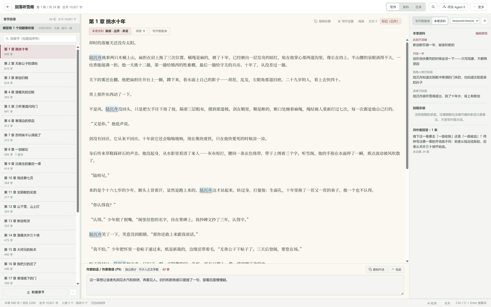 |

| 章纲与本章信息边界 | 项目 Agent：计划模式与待确认变更 |
| --- | --- |
| 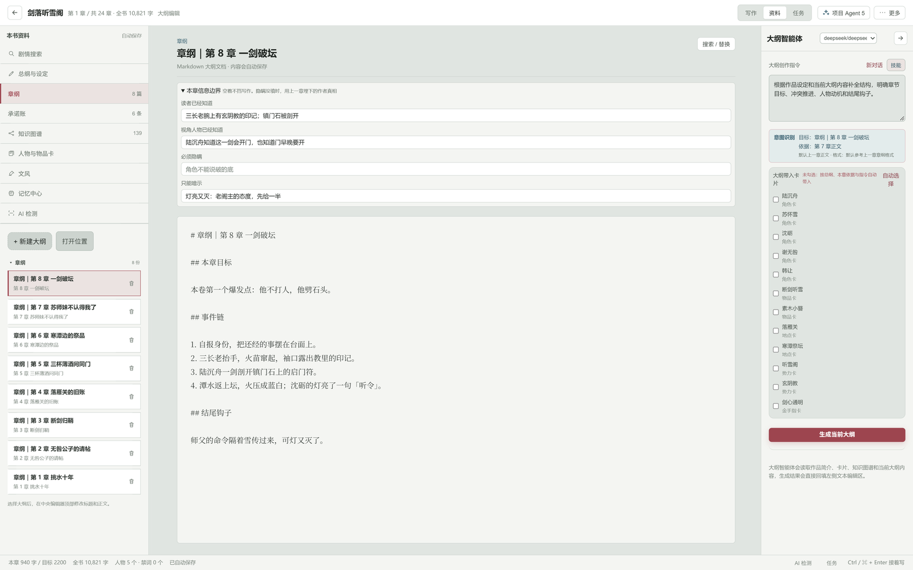 | 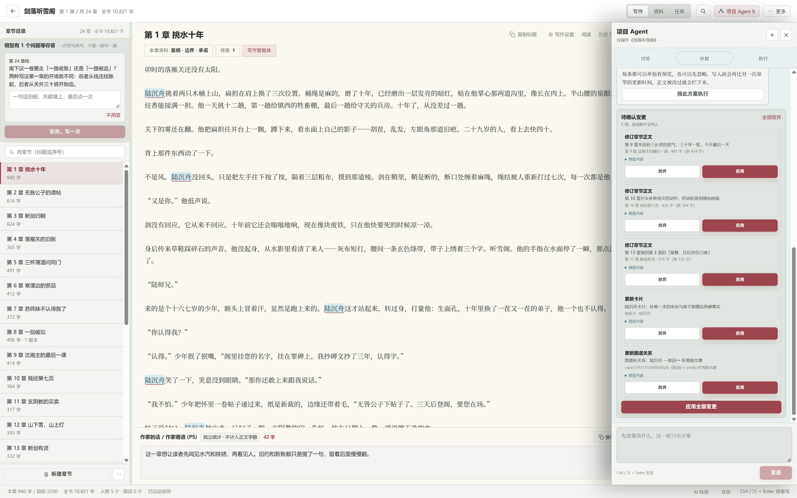 |

| 记忆中心：逐章记忆与聚合记忆 | 知识图谱：以任意节点为中心看关系 |
| --- | --- |
| 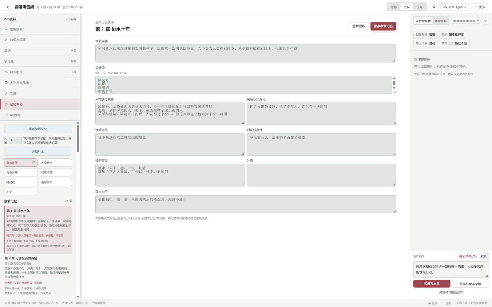 | 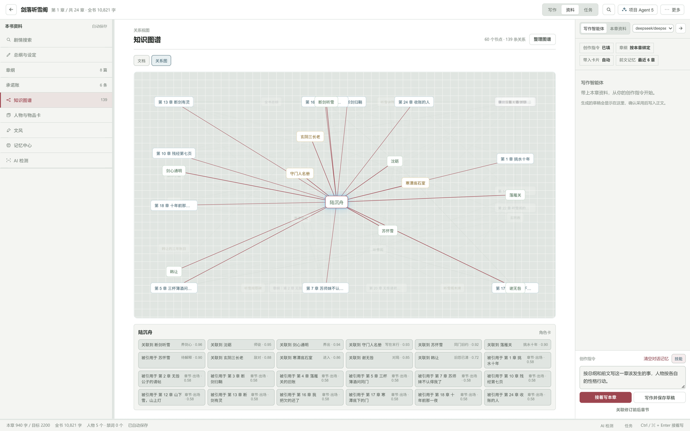 |

| 人物与物品卡：状态随章节更新 | 任务与产出：连续创作、重写旧章、审查旧章 |
| --- | --- |
| 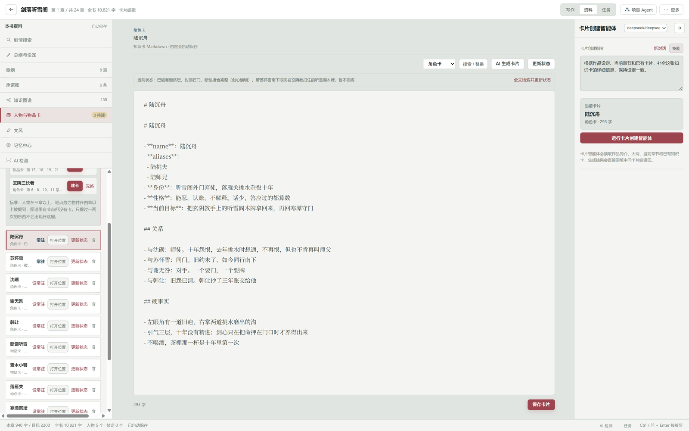 | 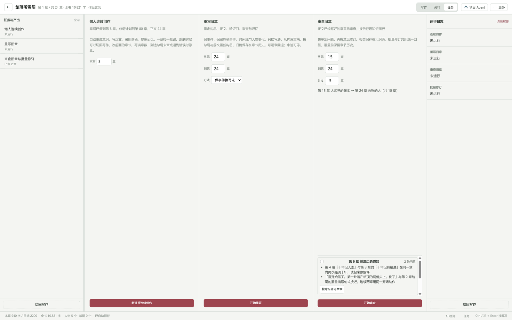 |

| 拆书管理：章纲、原创改写与全书聚合 | 书籍管理：下载状态与失败章节补下 |
| --- | --- |
| 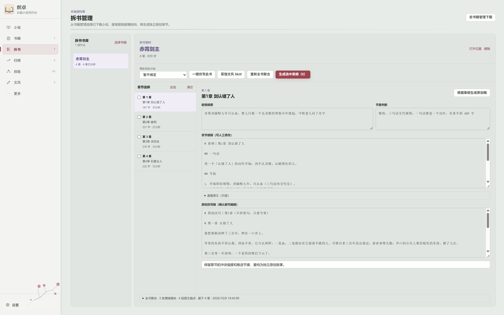 | 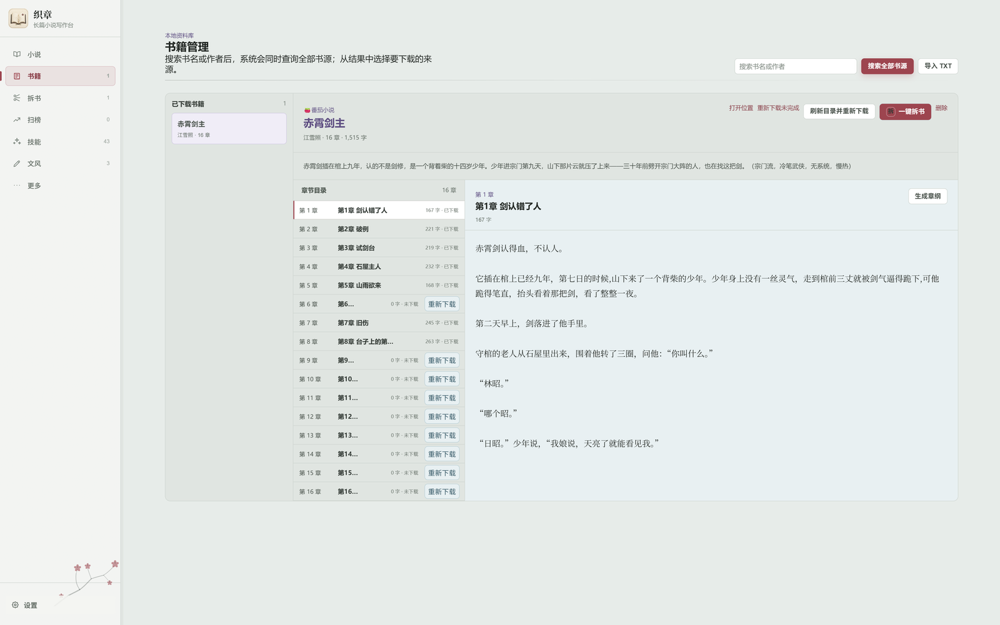 |

| 技能管理：43 个内置写作技能 | 模型与接口：多套配置随时切换 |
| --- | --- |
| 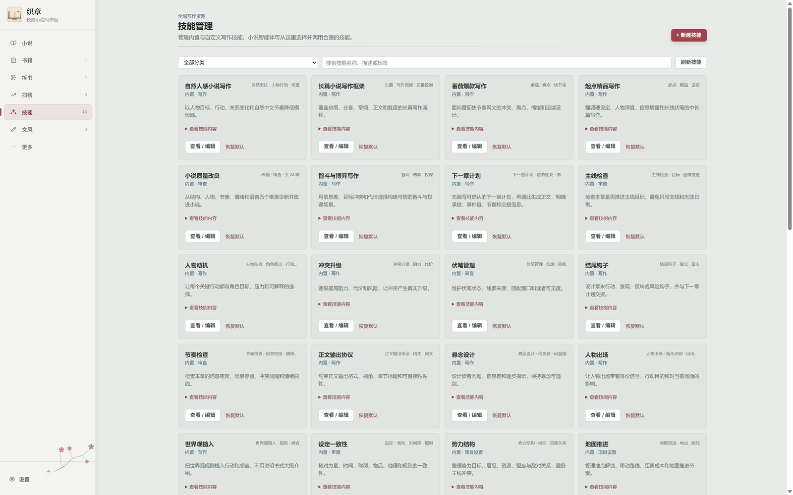 | 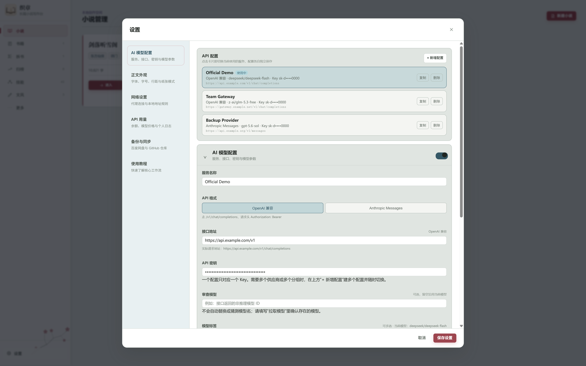 |

| 新建小说：封面、AI 生成书名与简介 |  |
| --- | --- |
|  |  |

## 它解决什么问题

| 长篇写作的真实麻烦 | 织章的做法 |
| --- | --- |
| 写到一百章，模型记不住前面发生过什么 | 章节记忆 + 全书记忆文档 + 承诺账，写新章时按模型窗口分配：放得下的保留全文，放不下的用摘要与账本 |
| 设定越来越多，改一次就要翻全书 | 卡片、图谱、章纲同源：卡片状态随章节刷新，图谱里点任意节点就能看到它被哪些章节引用 |
| 伏笔埋了就忘，读者比作者记得清楚 | 承诺账登记伏笔、期限与节奏，设了期限或节奏的条目到期后会自动进入本章提示词，审查报告再逐项核对 |
| AI 喜欢替作者拍板、说破不该说的事 | 章纲上的本章信息边界：读者已知 / 视角人物已知 / 必须隐瞒 / 只能暗示；拿不准的地方模型反过来提问 |
| 改一处牵动好几章，改完对不上 | 项目 Agent 计划模式只出方案，执行模式先给待确认变更预览，应用前还会比对基准版本，正文被改过就拦下来 |
| 参考作品的文风学不像 | 拆书管理提炼文风档案、情绪模块、节奏与原文锚点，再蒸馏成可绑定的文风 Skill |

## 快速开始

### 一、配置模型

织章不内置任何模型中转厂商，接口地址与 API Key 都由你自己填写，配置只保存在本机。

1. 打开「设置 → AI 模型配置」，点「+ 新增配置」。
2. 选择接口协议：OpenAI 兼容（`/v1/chat/completions`）或 Anthropic Messages（`/v1/messages`）。
3. 填写接口地址与 API Key，点「拉取模型」，勾选要启用的模型；一个配置只对应一个 Key，需要多个供应商就建多套配置随时切换。
4. 需要访问书籍源与榜单站点时，在「网络设置」里配置代理（模型请求与书源请求共用同一套网络参数）。

### 二、新建小说

在「小说管理」新建作品：书名、目标读者、作品标签、主角、作品简介，封面可选，书名与简介也能让模型先出草稿。

### 三、把资料立起来

先写资料，再写正文，后面每一章都会省力：

- **世界观与作品设定**：世界规则、体系、势力、地理和不能违背的事实。
- **总纲、卷纲、章纲**：全书主线、分卷目标与每章要推进的事件。
- **人物与物品卡**：角色卡、物品卡、地点卡、势力卡、金手指卡；卡片有「当前状态」，正文变化后可以一键刷新。
- **承诺账**：伏笔、期限、节奏和读者期待，例如「灯台上的枪必须在第 30 章响」。
- **文风与默认技能**：决定这一本书用什么表达方式写。

### 四、开始写第一章

1. 在「写作」视图给这一章建章纲，填好本章信息边界。
2. 在右侧「写作智能体」里写一句本章要做什么，点「接着写本章」。
3. 草稿会逐段出现，可以采用、重写或整章丢弃；模型拿不准的地方会变成待答问题。
4. 保存后提炼本章记忆，卡片状态与图谱随之更新。
5. 需要时跑审查、AI 检测、润色或去 AI 味。

## 工作区：写作、资料、任务

打开小说后，顶部是三个工作视图，右上角还有随时可调出的项目 Agent 面板与「更多」菜单。

### 写作

章节目录、正文编辑器、章节工具条与章节导航。右侧面板可以在「写作智能体」和「本章资料」之间切换：前者是写这一章的入口，后者把本章章纲、信息边界、到期承诺、待答问题和最近前文摊在一屏，随时对照。

底部有状态栏实时显示本章字数 / 目标字数、全书字数、出场人物与禁词命中；「作家的话」独立统计，不计入正文字数。

### 资料

一本书的公共资料，左侧分栏：总纲与设定、章纲、承诺账、知识图谱、人物与物品卡、文风、记忆中心、AI 检测。中间是 Markdown 编辑器，右侧是带卡片选择的大纲智能体。

### 任务

把重复劳动交给它，四个面板并列：

- **懒人连续创作**：从章纲到正文、草稿采用、记忆提炼，一章接着一章跑，可以随时停。
- **重写旧章**：保留原稿事件与时间线，只换写法；也可以从构思重新开始。
- **审查旧章与批量修订**：先对已写章节重跑审查、报告存进资料面板，再按意见批量修订。
- **运行日志**：每个任务的执行状态与产出。

### 项目 Agent

讨论全书、制定计划、提出待确认变更。**计划模式只出方案**，**执行模式**下所有写入先生成变更预览（改哪一章、改多少字、预览内容都能看到），你可以逐条应用或放弃；应用前会比对基准更新时间，提案生成后正文被改过就会要求重新处理，旧稿进历史版本。

### 更多

禁词标记与禁词列表、历史版本、通读当前章、格式化正文、写作统计、导出小说、快捷键、手动保存章节。

## 一章是怎么写出来的

1. **定章纲**：这一章要推进什么事件、开头接什么、结尾钩子落在哪儿。
2. **划边界**：读者已经知道什么、视角人物知道什么、什么必须隐瞒、什么只能暗示。
3. **带资料**：写作时自动带入作品设定、当前章纲、承诺账里到期的条目、相关卡片、前文记忆与最近正文。
4. **写作与提问**：模型写初稿，同时可以把拿不准的地方变成问题（「这一卷要走一路收账还是一路被追？」），一次答完再写，避免反复重写。
5. **采用与保存**：草稿逐段采用或整章重写，保存后旧稿进历史版本。
6. **回写项目**：提炼本章记忆（人物状态变化、角色认知、伏笔、时间线、设定事实、冲突），并同步卡片状态与图谱。
7. **自检**：跑审查报告、AI 内容检测，需要时润色或去 AI 味。

写作提示词里的约束只写「本章要做什么」：信息边界每章最多两条，到期的承诺要落到具体场面，悬而未决的问题要求给一次进展或表态而不是绕开。该收的线没收、说破不该说的事，由审查报告核对，不用靠堆禁止项。

## 长篇不失忆

| 机制 | 它管什么 |
| --- | --- |
| **章节记忆** | 每章一份快照：摘要、关键词、人物状态变化、角色认知变化、伏笔追踪、时间线、设定事实、冲突、章末钩子 |
| **记忆中心** | 逐章记忆可在界面里改；也可提炼成聚合文档：章节快照、人物状态、角色认知、伏笔追踪、时间线、设定事实、冲突 |
| **承诺账** | 伏笔与节奏的期限管理：填了期限或节奏的条目到期后进本章提示词，其余条目只作备忘 |
| **信息边界** | 每章单独的「谁能知道什么」，防止模型写漏或提前说破 |
| **知识图谱** | 章节、卡片、大纲、实体同图；关系图以选中节点为中心高亮，可以直接看出一个人物出现在哪些章、被哪些设定引用 |
| **卡片状态** | 人物、物品、地点、势力、金手指的当前状态与状态历史，随章节推进刷新 |
| **AI 检测** | 本地启发式检测正文的 AI 特征与疑似段落，在编辑器里标记，用于自检而不是打分 |

## AI 能力

- **43 个内置技能**：写作（自然人感写作、番茄爆款、起点精品、智斗与博弈、悬疑设计、情绪设计…）、审查（小说质量改良、主线检查、节奏检查、设定一致性、伏笔管理…）、分析、项目设置、导入导出与创作器；也可以自己新建技能。
- **文风绑定**：把参考作品蒸馏成文风 Skill，绑定到作品后章节与大纲生成都按它写；原文参考章节可留空。
- **拆书与仿写**：逐章提炼章纲、节奏、人物与信息揭示，生成原创改写稿；全书聚合出文风档案、情绪模块、节奏表与原文锚点。
- **项目 Agent**：跨章节调整大纲、卡片、设定与正文，全部先预览再写入。
- **审查与修订**：结构、人物、节奏、一致性逐项给证据，按意见修订或批量修订。
- **内容自检**：AI 特征检测、禁词标记、格式化正文、写作统计。

## 外部资源：书籍、拆书、扫榜

### 书籍管理

支持搜索与下载书籍，也支持导入本地 TXT。搜索全部书源时显示响应情况与来源；下载会保存目录、正文、失败章节及失败原因。

下载完成不等于每章都有正文，书源可能返回验证码、预览片段、付费限制或不完整目录，界面会区分目录总数与真正下载成功的章节：**重新下载未完成**补下失败章节并保留已有正文与人工章纲，**刷新目录并重新下载**用于目录漏章或书源更新。

### 拆书管理

只有完整下载的章节会进入拆书资料。建议先取开头连续 10～15 章覆盖一段完整小剧情，再补一组有铺垫、有高潮、有后果的中段章节，然后全书聚合。零散章节可以用来研究单章技巧，不足以推断整本书的节奏与伏笔回收。

### 扫榜管理

支持番茄、起点与飞卢入口：番茄含男频/女频阅读榜、新书榜与分类榜，起点含月票榜、阅读指数榜与签约榜。遇到限流或校验页会记录原因，换代理出口或稍后重试都不保证上游始终可访问。

## 数据在哪里

项目资料、书籍、拆书、文风、榜单与 Agent 会话都保存在本机的应用数据目录中，按目录分开放置：

```text
<应用数据目录>/
├── projects/    # 每部小说：metadata.json + 章节/ 大纲/ 卡片/ 记忆/ 图谱/
├── books/       # 下载的参考书
├── dismantles/  # 拆书资料
├── styles/      # 文风档案
├── rankings/    # 榜单缓存
└── agent-chats/ # 项目 Agent 会话与变更记录
```

章节与资料都以 Markdown 落盘，不经应用也能打开、备份和 diff。同步由你主动触发：「设置 → 备份与同步」支持完整备份到百度网盘或 GitHub 仓库，换设备后恢复同一份创作资料。

## 本地开发

### 环境要求

- Node.js 22+（CI 与本机开发使用 24；测试脚本依赖 Node 22 起的 `node --test` glob 支持）
- Rust stable 与 Tauri 对应平台依赖
- macOS/iOS 需要 Xcode，Android 需要 Android SDK，Windows 需要对应构建环境

### 启动

```bash
npm install
npm install --prefix desktop-app
npm run tauri:dev --prefix desktop-app
```

### 构建

```bash
npm run tauri:build --prefix desktop-app
```

移动端构建见 [desktop-app/MOBILE.md](desktop-app/MOBILE.md)。

### 项目结构

```text
织章/
├── packages/contracts/      # 桌面端、移动端与 Agent Runtime 的共享 RPC 契约
├── packages/model-protocol/ # OpenAI/Anthropic 协议与认证转换
├── desktop-app/             # React + TypeScript + Tauri 客户端
│   ├── src/domain/          # 项目、章节、记忆、卡片与图谱领域模型
│   ├── src/features/        # 编辑器、项目 Agent、资料面板等功能模型
│   ├── src/services/        # Agent 与原生能力端口
│   ├── src/platform/        # 移动书源与云同步适配器
│   └── src-tauri/           # Rust 原生能力与资源存储
├── sidecars/agent-runtime/  # Node.js 写作智能体、上下文、书源与本地存储
├── schema/                  # 本地数据结构
└── scripts/                 # 构建与发布脚本
```

- **客户端**：React、TypeScript、Vite、Tauri 2，按 domain / features / services / platform 分层。
- **智能体运行时**：Node.js、TypeScript，RPC registry 按模型、内容、书库与写作职责分发。
- **共享契约与协议**：`packages/contracts` 统一 RPC 方法与事件，`packages/model-protocol` 统一认证与消息转换。

## 近期更新

- 按设计稿重整书内「写作 / 资料 / 任务」三个工作区，长篇工作面从单页扩成可对照的工作台。
- 项目 Agent 增加编辑保护与进度保留：提案生成后基准被改过会被拦下，执行中断后能接着跑。
- 章节记忆、卡片状态与知识图谱随正文回写；记忆可逐章改，也可批量补全。
- 书源与榜单下载可靠性改进：区分目录总数与真正下载成功的章节，未完成章节可补下。
- 写作提示词约束与三档审查规则文档化，见 [docs/writing-quality-gates.md](docs/writing-quality-gates.md)。

## 相关文档

- [ARCHITECTURE.md](ARCHITECTURE.md)：运行边界、模块职责与重构约束。
- [DESIGN.md](DESIGN.md)：设计系统、配色与主题取值。
- [docs/writing-quality-gates.md](docs/writing-quality-gates.md)：写作质量门与三档审查规则。
- [TODO.md](TODO.md)：还没做完的事与阶段验收。
- [desktop-app/MOBILE.md](desktop-app/MOBILE.md)：移动端构建说明。

## 隐私与安全

- 模型厂商与接口中转站的余额、计费和风控由你自己的配置负责，不在本仓库内。
- API Key、访问令牌、Cookie、签名证书、个人小说正文与云端备份内容不随源码提交。
- 不要在 Issue、Pull Request、日志或截图中提交密钥、Cookie、备份文件或私密作品资料。
- 本项目界面截图使用专门的演示作品与占位接口配置，不含任何真实作品与密钥。

开始贡献前请阅读 [CONTRIBUTING.md](CONTRIBUTING.md) 与 [SECURITY.md](SECURITY.md)。

## 许可证

本项目以 [GNU Affero General Public License v3.0 or later](LICENSE) 发布，第三方依赖仍受各自许可证约束。
